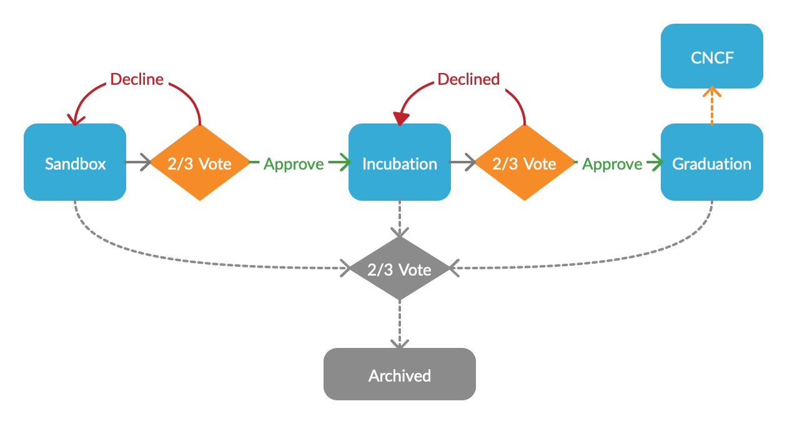

# Azure Cloud Native Upstream Graduation Guidelines v0.1
The Azure Cloud Native Upstream Graduation Guidelines owes much of its basis on two existing documents,
[CNCF Graduation Criteria](https://github.com/cncf/toc/blob/fc161c13a86ba022277a906a10ff51a568406f7c/process/graduation_criteria.adoc) 
and [.NET Foundation Project Maturity Profile](https://github.com/dotnet-foundation/project-maturity-model/blob/65fdfa43d7e68845bd65638c378cf834d7158b90/maturity-profiles.md). The goal of this document is to describe the process and 
minimum bar for each increasing level of project maturity to both provide a
goal for the project maintainers, but also to set expectations for consumers of these
projects.

## Process

Each project in Azure Cloud Native Upstream (AzCNU) has an associated maturity level. If the 
project originates within the AzCNU group, then it should begin at the Sandbox Stage. If a project
originates outside of the AzCNU group, the preferred maturity level of the project must meet 
a 2/3 supermajority vote by the AzCNU technical oversight committee (TOC). If the vote tally 
can not be met at the preferred maturity level, each previous level will receive a vote until a 
2/3 supermajority is met. If the project does not receive enough votes at the Sandbox stage, the
project is rejected with an opinion authored by the TOC.

Each project in AzCNU will participate in a quarterly review by the TOC. The review will assess the 
project's maturity level as well as its community momentum. A 2/3 supermajority vote is required to 
graduate to the next maturity level. If the project is no longer needed or has become obsolete, the 
TOC can also vote with a 2/3 supermajority to archive the project.

For a project that has reached the "Graduation Stage" and would benefit from a more neutral home in 
a community foundation, the option of project donation is an option.

All entry guidelines are aspirational and do not imply a hard rule. Since these metrics can vary 
significantly depending on the type, scope and size of a project, the TOC has final judgement over
the interpretation of level with respect to the guidelines.

## Sandbox Stage
Sandbox projects are early stage projects that warrant experimentation. The project should be 
beneficial to Azure and the Cloud Native community, open to contributions from the public and have 
well-founded aspiration.

The AzCNU Sandbox is the entry point for early stage projects and has the following goals:
- Encourage public visibility of experiments or other early work that can add value to the mission 
  of AzCNU, Cloud Native in Azure and its impact on the larger Cloud Native community.
- Facilitate alignment with existing projects within Azure as well as the larger community
- Remove obstacles to adoption and contribution by ensuring projects adhere to Microsoft Open Source
  Guidelines, code of conduct and IP policy requirements
  
### Entry Guidelines
- Best effort support for issues and pull requests
- Sponsorship of at least one member of the MSFT program management
- Draft project proposal for review and approval by TOC
  - An example is the [CNCF Project Proposal Process](https://github.com/cncf/toc/blob/fc161c13a86ba022277a906a10ff51a568406f7c/process/project_proposals.adoc)
  - TODO: create our own project proposal process based on the CNCF project proposal process
- Begin working toward achieving [Core Infrastructure Initiative Best Practices Badge](https://bestpractices.coreinfrastructure.org/)
  - Should have 
    - Gated PRs with unit tests
    - MSFT code of conduct
    - CLA bot enabled

### Badging
- Display of the AzCNU "Sandbox" badge on website / readme which links to explanation of level.

## Incubating Stage
An Incubating project is one that has met all of the requirements of the Sandbox stage and is 
showing accelerating adoption.

### Entry Guidelines
- Met Sandbox stage guidelines
- Best effort support for issues and pull requests
- 3+ reference-able production or preproduction deployments beyond contributing companies
- 2+ maintainers
- Full due diligence of the TOC
  - A great example is the [CNCF Due Diligence Guidelines](https://github.com/cncf/toc/blob/fc161c13a86ba022277a906a10ff51a568406f7c/process/due-diligence-guidelines.md)
  - TODO: create our own DD guidelines based on the CNCF DD guidelines
- Demonstrate a substantial ongoing flow of commits and merged contributions
- Have a healthy number of issues and pull requests
- Set a clear, documented versioning scheme
- Show significant progress toward achieving [Core Infrastructure Initiative Best Practices Badge](https://bestpractices.coreinfrastructure.org/)
  - Should have 
    - UT covering a majority of the codebase
    - E2E tests covering 100% of all supported features/functionality 
    - Linting
    - Static analysis (where appropriate)
    - An initial security review
    - Contributing guide
    - Issue and PR templates
    - Public project board with prioritization
    - Milestones for releases
- Telemetry for errors and general usage
  - If not possible, provide reasoning for why

### Badging
- Display of the AzCNU "Incubation" badge on website / readme which links to explanation of level.

## Graduation Stage
Graduation Stage project is one that has met all of the requirements of the Incubation stage and has
reached a level of maturity and polish which will delight users.

### Entry Guidelines
- Met Incubation stage guidelines
- On-call support within MSFT hosted properties, and best effort support for issues and pull requests
- 30+ reference-able production or preproduction deployments beyond contributing companies
- 4+ maintainers (at least one from outside AzCNU)
- Project road map published and updated
- Full due diligence of the TOC with an eye to any misalignment
- Have achieved and maintained a [Core Infrastructure Initiative Best Practices Badge](https://bestpractices.coreinfrastructure.org/)
  - Should have
    - Load tests and performance tests
  - Bonus for achieving Silver or higher
- Security review and threat analysis with the Azure Green / Red teams
- Explicitly define a project governance and committer process. This preferably is laid out in a 
  GOVERNANCE.md file and references an OWNERS.md file showing the current and emeritus committers.
- Have a public list of project adopters for at least the primary repo (e.g., ADOPTERS.md or logos 
  on the project website). For a specification, have a list of adopters for the implementation(s) 
  of the spec.
- SLA / SLO guidance
- Telemetry and Metrics for errors and general usage
  - Include identifiable headers (ex: calling Azure services with the `User-Agent` http header specified)
  - Define a set of KPIs and publish
  - Setup alerting for anomalous value ranges (ex: life cycle success rates -- create, update, etc)
  - If not possible, provide reasoning for why

### Badging
- Display of the AzCNU "Graduation" badge on website / readme which links to explanation of level.

## Donation
At any point in the maturity progression can a project be donated to a more neutral home, which
will provide a more open governance model. A project can propose to be donated during quarterly
reviews. The TOC can approve donation of a project with a 2/3 supermajority vote. Project maintainers
should provide evidence of interest from the foundation intended for donation.

For example, CNCF describes a neutral home as follows:
A neutral home for your project increases the willingness of developers from other companies and 
independent developers to collaborate, contribute, and become committers. Neutrality requires that 
projects contribute their trademark to CNCF so that:

- No company is favored over any other
- CNCF ensures project governance is transparent and fair for everyone.

Some projects which are not directly tied to Azure may warrant such a graduation so they can gain 
more adoption through increased neutrality and governance.
